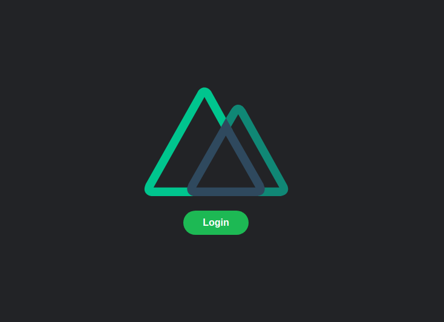
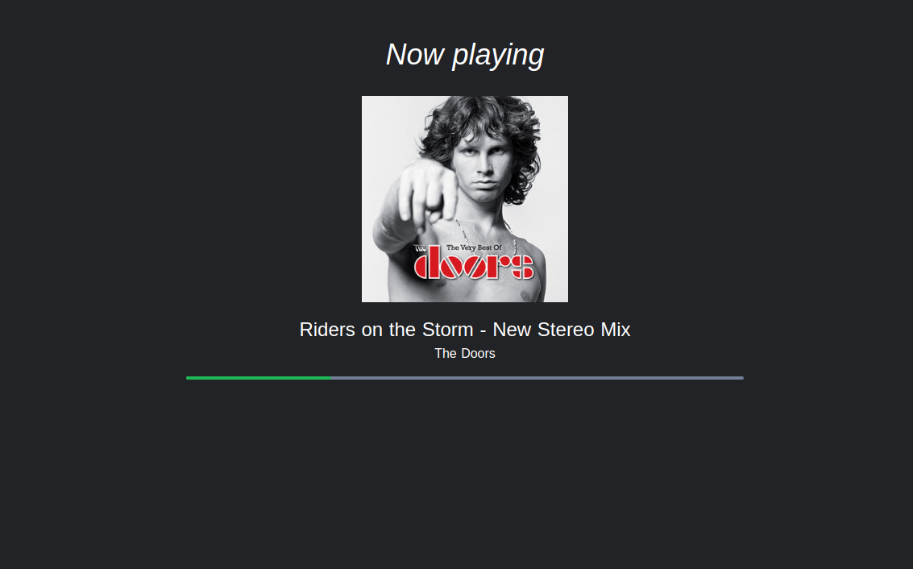

# songstatsApp

The idea of this project is that you could login with Spotify and then see cool stuff about the current playing song, like interesting facts, release year, popularity and more!




Right now at this moment I had to stop developing because couldn't find an appropiate API to work with this data, Songfacts API is not free and it's not even open to general public. I'll continue this project when something is available.

This APP is just the frontend, built with Nuxt and Tailwind, for the backend check my other [repository built with Lumen](https://github.com/macr1408/Songstats-API)

## Build Setup

``` bash
# install dependencies
$ yarn install

# serve with hot reload at localhost:3000
$ yarn dev

# build for production and launch server
$ yarn build
$ yarn start

# generate static project
$ yarn generate
```

For detailed explanation on how things work, check out [Nuxt.js docs](https://nuxtjs.org).
